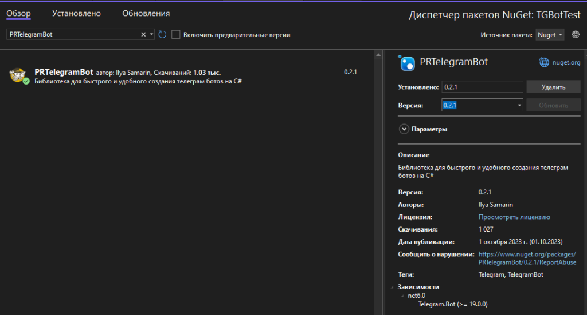
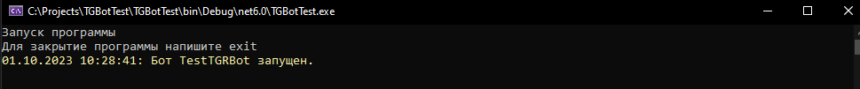

# Быстрый старт

Для начала работы с телеграм ботами потребуется создать нового бота через BotFather.

@BotFather — это главный сервис telegram, через который проходит регистрация всех пользовательских ботов.

> Для получения токена от BotFather в Telegram, следуйте этим шагам:
>
> 1. Откройте Telegram и найдите “BotFather”. Это официальный бот Telegram, который поможет вам создать и настроить своего бота.
> 2. Начните диалог с BotFather, нажав кнопку “Start” или отправив ему команду “/start”.
> 3. Отправьте команду “/newbot”, чтобы создать нового бота.
> 4. BotFather попросит вас ввести имя для вашего бота. Введите желаемое имя и следуйте инструкциям.
> 5. После успешного создания бота BotFather выдаст вам токен доступа. Это будет выглядеть примерно так: “1234567890:ABCDEFGHIJKLMNOPQRSTUVXYZ”.
> 6. Скопируйте полученный токен. Этот токен уникален для вашего бота и используется для аутентификации и взаимодействия с API Telegram.

После создания бота в BotFather в проект нужно установить последнюю версию библиотеки PRTelegramBot. Установить ее можно либо через [nuget](https://www.nuget.org/packages/PRTelegramBot) либо через [github](https://github.com/prethink/PRTelegramBot).

### Установка PRTelegramBot через nuget

1. Нажмите правой кнопкой мыши на проект в который хотите установить PRTelegramBot.
2. Выберите пункт “Управление пакетами NuGet”.

<figure><figcaption></figcaption></figure>

3\. В обзоре в поле поиск напишите “PRTelegramBot”

4\. Выбрав последнюю версию нажмите установить.

<figure><figcaption></figcaption></figure>

Telegram.Bot начиная с версии 20, стали размещать свои nuget пакеты на новом адресе [https://nuget.voids.site/](https://nuget.voids.site/), поэтому может возникать следующая ошибка:

<figure><figcaption></figcaption></figure>

В этом случае нужно добавить в настройки nuget еще 1 источник пакетов "https://nuget.voids.site/v3/index.json". Настраивается это в Средства -> Параметры -> Диспетчер пакетов nuget -> источники пакетов. <br>

<figure><figcaption></figcaption></figure>

Начиная с версии 22 telegram.bot это становится не актуальным. В 22 версии его вернули в nuget.

5. После установки можно начинать работать с ботом.

### Начало работы с PRTelegramBot

Для инициализации нового бота напишите

```csharp
//Экземпялр класса PRTelegramBot
var telegram = new PRBotBuilder("Token").Build();
 
//Подписка на простые логи
telegram.OnLogCommon += Telegram_OnLogCommon;
//Подписка на логи с ошибками
telegram.OnLogError += Telegram_OnLogError;
 
//Запуск бота
await telegram.StartAsync();
 
//Обработка общих ошибок
async Task Telegram_OnLogError(ErrorLogEventArgs e)
{
    //Обработка ошибок.
}

async Task Telegram_OnLogCommon(CommonLogEventArgs e)
{
    //Обработка логов.
}
```

Описание билдера ботов - [PRBotBuilder](../prbotbuilder-sozdanie-botov.md).

Результат работы:

<figure><figcaption></figcaption></figure>

В одном проекте вы можете задействовать сразу несколько ботов, для этого воспользуйтесь свойством **BotId**. У вас может быть 5 одновременно запущенных ботов, который занимаются одной и той же обработкой данных, так и 5 разных у которых может быть свой функционал.

Пример консольного приложения - [https://github.com/prethink/PRTelegramBot/tree/master/ConsoleExample](../../ConsoleExample)

Пример ASP.Net Core - [https://github.com/prethink/PRTelegramBot/tree/master/AspNetExample](../../AspNetExample)
