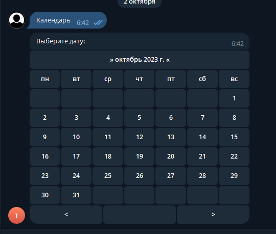
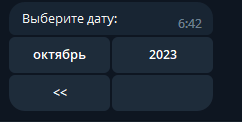
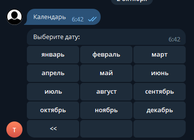

# Working with the calendar

Asking a user to type a date invites every format at once — `01/02/2026`, `2 January`, `завтра`. The built-in calendar removes the question: the user taps a date and the bot receives a `DateTime`.

It is based on [CalendarPicker by karb0f0s](https://github.com/karb0f0s/CalendarPicker).

<figure><figcaption>Picking a day</figcaption></figure>

<figure><figcaption>Tapping the header moves up to months…</figcaption></figure>

<figure><figcaption>…and again to years, so a distant date is a few taps away</figcaption></figure>

<figure><figcaption>The selected date arrives at your handler</figcaption></figure>

Everything goes through [`CalendarUtils`](https://prethink.gitbook.io/prtelegrambot/ru/api/utils/calendarutils).

## Showing the calendar

```csharp
/// <summary>
/// Write "Calendar" in the chat.
/// </summary>
[ReplyMenuHandler("Calendar")]
public static async Task PickCalendar(IBotContext context)
{
    try
    {
        await CalendarUtils.Create(context, CustomTHeader.CalendarCallback, "Pick a date:");
    }
    catch (Exception ex)
    {
        Console.WriteLine(ex);
    }
}
```

The second argument is the command header the selected date will come back under — an ordinary [inline command](inline-commands/), so it needs a value in an `[InlineCommand]` enum.

## In another language

Pass a `CultureInfo` and the month and day names follow it:

```csharp
/// <summary>
/// Write "EngCalendar" in the chat.
/// </summary>
[ReplyMenuHandler("EngCalendar")]
public static async Task EngPickCalendar(IBotContext context)
{
    try
    {
        await CalendarUtils.Create(context, CultureInfo.GetCultureInfo("en-US", false), CustomTHeader.CalendarCallback, "Choose date:");
    }
    catch (Exception ex)
    {
        Console.WriteLine(ex);
    }
}
```

Without a culture the calendar follows the process's current one, which on a server is rarely what your users would choose. If your bot knows the user's language, pass it explicitly.

## Receiving the date

The date arrives as a `CalendarTCommand`:

```csharp
/// <summary>
/// Handles the selected date.
/// </summary>
[InlineCallbackHandler<CustomTHeader>(CustomTHeader.CalendarCallback)]
public static async Task PickDate(IBotContext context)
{
    var bot = context.Current;
    try
    {
        using (var inlineHandler = new InlineCallback<CalendarTCommand>(context))
        {
            var command = inlineHandler.GetCommandByCallbackOrNull();
            await MessageSender.Send(context, command.Data.Date.ToString());
        }
    }
    catch (Exception ex)
    {
        bot.Events.OnErrorLogInvoke(new ErrorLogEventArgs(context, ex));
    }
}
```

`command.Data.Date` is a `DateTime` — no parsing, and no format to get wrong.


The same handler receives every tap on the calendar, including moving between months and years, not only the final choice. `CalendarTCommand` carries which action it was, so a handler that answers unconditionally will answer while the user is still navigating.

