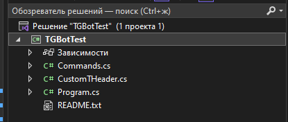
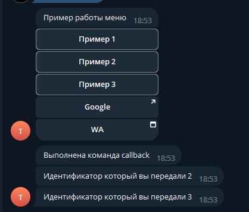

# Handling inline commands

A handler for an `InlineCallback` button looks like this:

```csharp
[InlineCallbackHandler<TheEnum>(TheEnum.Value)]
public static async Task MethodName(IBotContext context)
{
    // Handling.
}

[InlineCallbackHandler<TheEnum>(TheEnum.Value, TheEnum.OtherValue)]
public static async Task MethodName(IBotContext context)
{
    // Handling.
}
```

One method can serve several commands — list every value the attribute should answer for.

## If the attribute does not compile

`InlineCallbackHandler` is a **generic attribute**, which needs C# 11.

<figure><figcaption>What an older language version reports</figcaption></figure>

Open the project's properties — double-click the project in Solution Explorer — and set the language version.

<figure><figcaption>Double-clicking the project opens its file</figcaption></figure>

<figure><figcaption>Add <code>&lt;LangVersion&gt;11.0&lt;/LangVersion&gt;</code></figcaption></figure>

Or set it directly:

```xml
<PropertyGroup>
  <LangVersion>11.0</LangVersion>
</PropertyGroup>
```

Projects created against .NET 7 or later already use a language version new enough; this only comes up on older ones. `latest` works too.

## Reading the data

`GetCommandByCallbackOrNull` parses the `callback_data` back into the type the button carried.

```csharp
/// <summary>
/// A callback handler with a single entry point.
/// </summary>
[InlineCallbackHandler<CustomTHeader>(CustomTHeader.ExampleOne)]
public static async Task Inline(IBotContext context)
{
    // Try to read the callback data as the type expected.
    var command = InlineCallback.GetCommandByCallbackOrNull(context);
    if (command != null)
    {
        string msg = "The callback command ran";
        await MessageSender.Send(context, msg);
    }
}

/// <summary>
/// A callback handler serving several entry points.
/// </summary>
[InlineCallbackHandler<CustomTHeader>(CustomTHeader.ExampleTwo, CustomTHeader.ExampleThree)]
public static async Task InlineTwo(IBotContext context)
{
    var command = InlineCallback<EntityTCommand<long>>.GetCommandByCallbackOrNull(context);
    if (command != null)
    {
        string msg = $"The identifier you passed: {command.Data.EntityId}";
        await MessageSender.Send(context, msg);
    }
}
```

Use the non-generic `InlineCallback` when the button carries no payload, and `InlineCallback<T>` when it does.


The `T` here must match what the button was **built** with. A button carrying `EntityTCommand<long>` read as `EntityTCommand<string>` cannot be parsed: the converter logs a `JsonException`, returns `null`, and the `if` above quietly does nothing. Nothing is reported to the user, and nothing appears to happen.

That is why the null check matters — and why, when a button seems dead, the type is the first thing to compare.


<figure><figcaption>The payload arrives at the handler</figcaption></figure>
