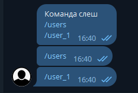
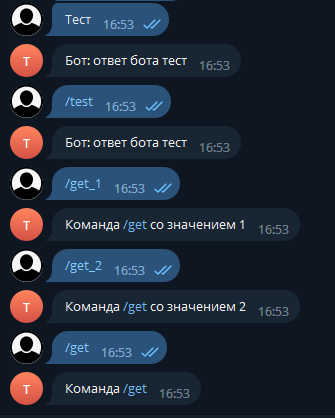

# Slash commands

Telegram renders slash commands as clickable links, so a bot can offer actions the user taps rather than types — `/users` to list people, `/get_1` to open the one with id 1.

<figure><figcaption>Telegram makes every <code>/command</code> in the text clickable</figcaption></figure>

See [Parameters](parameters.md) for what `botId`, `CommandComparison` and `StringComparison` mean.

## The attribute

Slash commands use **`SlashHandler`**. It has one parameter the other attributes do not: **`splitChar`**, the character separating the command from its arguments.

```csharp
/// <param name="botIds">Bot identifiers.</param>
/// <param name="commandComparison">How to compare the command.</param>
/// <param name="stringComparison">How to compare the string.</param>
/// <param name="splitChar">Separator character.</param>
/// <param name="commands">Commands.</param>
public SlashHandlerAttribute(params string[] commands)
public SlashHandlerAttribute(char splitChar, params string[] commands)
public SlashHandlerAttribute(long botId, params string[] commands)
public SlashHandlerAttribute(long botId, char splitChar, params string[] commands)
public SlashHandlerAttribute(CommandComparison commandComparison, params string[] commands)
public SlashHandlerAttribute(CommandComparison commandComparison, char splitChar, params string[] commands)
public SlashHandlerAttribute(StringComparison stringComparison, params string[] commands)
public SlashHandlerAttribute(CommandComparison commandComparison, StringComparison stringComparison, params string[] commands)
public SlashHandlerAttribute(long botId, CommandComparison commandComparison, StringComparison stringComparison, char splitChar, params string[] commands)
// ...and the same set again taking long[] botIds
```

Unlike reply commands, `CommandComparison` here defaults to **`Contains`** — which is what lets `/get_1` reach the handler registered for `/get`.

## Reading the arguments

`context.GetSlashArgs()` returns the arguments as strings. `context.GetSlashArgs<T>()` converts them — to `int`, `bool`, or anything else convertible.

### A command with no arguments

```csharp
/// <summary>
/// Runs for the bot with botId 0, when the user writes "/example".
/// </summary>
[SlashHandler("/example")]
public static async Task ExampleSlashCommand(IBotContext context)
{
    string msg = "Command /example";
    msg += "\n /get_1 - command 1" +
        "\n /get_2 - command 2" +
        "\n /get_3 - command 3" +
        "\n /get_4 - command 4";

    await MessageSender.Send(context, msg);
}
```

### Arguments after an underscore

```csharp
/// <summary>
/// Runs on "/get", and on "/get_1" — where 1 arrives as an argument.
/// </summary>
[SlashHandler('_', "/get")]
public static async Task ExampleSlashCommandGet(IBotContext context)
{
    var args = context.GetSlashArgs();

    if (args.Count == 0)
    {
        await MessageSender.Send(context, "Command /get");
        return;
    }

    if (args.Count == 1)
    {
        await MessageSender.Send(context, $"Command /get with value: {args[0]}");
        return;
    }

    string joinedArgs = string.Join(", ", args);
    await MessageSender.Send(context, $"Command /get with values: {joinedArgs}");
}
```


### Commands addressed to the bot in a group

In a group, Telegram addresses a command to a specific bot by appending its username: tapping `/get_3` in the command list sends `/get_3@my_bot`.

The framework takes that suffix off before anything else reads the text, so `args` holds `3` in both a private chat and a group. This matters most when the bot's own username contains the separator — with a bot named `cs2_server_bot`, the raw text `/get_3@cs2_server_bot` split on `_` would otherwise yield `3@cs2`, `server` and `bot` instead of the single argument.

The suffix comes off whoever it names, so a group holding several bots is left to sort itself out: each bot answers the commands it recognises. If you want yours to keep quiet when another bot was addressed, compare the mention against `bot.BotName` in a
[pre-execution check](pre-execution-checks.md).

### Typed arguments

```csharp
/// <summary>
/// Runs on "/int" and "/int_1", where 1 arrives already converted.
/// </summary>
[SlashHandler('_', "/int")]
public static async Task ExampleSlashIntCommandGet(IBotContext context)
{
    var args = context.GetSlashArgs<int>();
    // ...
}

/// <summary>
/// Runs on "/bool" and "/bool_true".
/// </summary>
[SlashHandler('_', "/bool")]
public static async Task ExampleSlashBoolCommandGet(IBotContext context)
{
    var args = context.GetSlashArgs<bool>();
    // ...
}
```

Arguments that cannot be converted are dropped rather than throwing, so check `args.Count` before indexing.

<figure><figcaption>The same handler answering with no argument, one argument and several</figcaption></figure>

### /start and deeplinks

Using a space as the separator handles `/start`, which Telegram uses for deeplinks: a link of the form `t.me/yourbot?start=payload` opens the chat and sends `/start payload`.

```csharp
/// <summary>
/// Runs on "/start", and on "/start 1" where 1 arrives as an argument.
/// </summary>
[SlashHandler(' ', "/start")]
public static async Task ExampleSlashCommandStart(IBotContext context)
{
    var args = context.GetSlashArgs();

    if (args.Count > 0)
    {
        await MessageSender.Send(context, $"Command /start with value {args[0]}");
        return;
    }

    await MessageSender.Send(context, "Command /start");
}
```

That is how referral links, invitations and "open this item" links are built.

## Exact matching

To accept only the bare command and nothing after it, ask for `Equals`:

```csharp
/// <summary>
/// Runs only on exactly "/equals", ignoring case. "/equals_1" does not match.
/// </summary>
[SlashHandler(CommandComparison.Equals, "/equals")]
public static async Task ExampleSlashEqualsCommand(IBotContext context)
{
    await MessageSender.Send(context, nameof(ExampleSlashEqualsCommand));
}

/// <summary>
/// Runs only on exactly "/equalsreg", case-sensitively.
/// "/equalsreG" and "/Equalsreg" do not match.
/// </summary>
[SlashHandler(CommandComparison.Equals, StringComparison.Ordinal, "/equalsreg")]
public static async Task ExampleSlashEqualsRegisterCommand(IBotContext context)
{
    await MessageSender.Send(context, nameof(ExampleSlashEqualsRegisterCommand));
}
```
