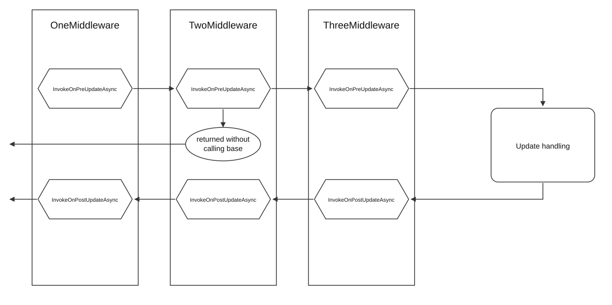

# Middleware

Middleware are building blocks that wrap and extend the bot's main update handler. Each component receives the context and passes it to the next one in the chain, exactly like middleware in ASP.NET. The chain runs once before the update is handled and once after.

<figure><figcaption></figcaption></figure>

**`InvokeOnPreUpdateAsync`** runs before the update is handled.

**`InvokeOnPostUpdateAsync`** runs after it.

Both are virtual, so you override the ones you need.

**`ExecutionOrder`** sets the position in the pipeline. A lower value means higher priority and earlier execution.

To write your own, derive from [`MiddlewareBase`](https://prethink.gitbook.io/prtelegrambot/ru/api/klassy/middlewarebase) and override the two methods. Do not forget to call the base implementation — that is what passes control along the chain.

## Example

```csharp
using PRTelegramBot.Core.Middlewares;
using PRTelegramBot.Interfaces;

namespace ConsoleExample.Middlewares
{
    public class OneMiddleware : MiddlewareBase
    {
        public override int ExecutionOrder => 0;

        public override async Task InvokeOnPreUpdateAsync(IBotContext context, Func<Task> next)
        {
            Console.WriteLine("First handler, before the update");
            await base.InvokeOnPreUpdateAsync(context, next);
        }

        public override Task InvokeOnPostUpdateAsync(IBotContext context)
        {
            Console.WriteLine("First handler, after the update");
            return base.InvokeOnPostUpdateAsync(context);
        }
    }
}
```

## Registering middleware

Through the builder, or through dependency injection:

```csharp
// Through DI.
builder.Services.AddScoped<MiddlewareBase, DIMiddleware>();
builder.Services.AddTransient<MiddlewareBase, UserMiddleware>();

// Through the builder.
var telegram = new PRBotBuilder("Token")
                    .SetBotId(0)
                    .AddConfigPath(ExampleConstants.BUTTONS_FILE_KEY, ".\\Configs\\buttons.json")
                    .AddConfigPath(ExampleConstants.MESSAGES_FILE_KEY, ".\\Configs\\messages.json")
                    .AddAdmin(1111111)
                    .SetClearUpdatesOnStart(true)
                    .AddReplyDynamicCommands(dynamicCommands)
                    .AddMiddlewares(new OneMiddleware(), new TwoMiddleware(), new ThreeMiddleware())
                    .Build();
```

## Order of execution

The order comes from `ExecutionOrder`, **not** from the order you added them in.

With `OneMiddleware` at 0, `TwoMiddleware` at 1 and `ThreeMiddleware` at 2, the pre-update pass runs:

* OneMiddleware
* TwoMiddleware
* ThreeMiddleware

and the post-update pass runs in reverse:

* ThreeMiddleware
* TwoMiddleware
* OneMiddleware

The chain nests rather than repeats: what wrapped first unwraps last.

## Stopping the chain

To stop an update from going any further, return without calling the base method. Nothing downstream runs, and the post-update pass only unwinds the middleware that had already been entered.
