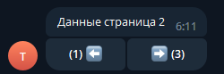

# Paginated messages

Rather than sending a hundred messages, send one and let the user page through it. The next and previous buttons edit the message in place, so the chat stays clean.

<figure><figcaption>The message is edited in place as the user pages</figcaption></figure>

Two pieces do the work:

* `GetPaged` — an extension that slices a collection into pages;
* `MenuGenerator.GetPageMenu` — builds the navigation keyboard.

## The command enum

Paging is an inline command, so it needs a header enum — see [Inline commands](command-handling/inline-commands/). Give each paged list its own header, so one handler can tell them apart.

```csharp
[InlineCommand]
public enum CustomTHeaderTwo
{
    [Description("Example 1")]
    ExampleOne = 600,
    [Description("Example 2")]
    ExampleTwo,
    [Description("Example 3")]
    ExampleThree,
    [Description("Pages example")]
    CustomPageHeader,
    [Description("Pages example 2")]
    CustomPageHeader2,
}
```

## Some data

```csharp
static List<string> pageData = new List<string>()
{
    "Data page 1",
    "Data page 2",
    "Data page 3",
    "Data page 4",
    "Data page 5"
};

static List<string> pageDataTwo = new List<string>()
{
    "Test data page 1",
    "Test data page 2",
    "Test data page 3",
    "Test data page 4",
    "Test data page 5"
};
```

## Building the navigation

`MenuGenerator.GetPageMenu` has several overloads. They all take the current page, the page count and the command header; they differ in what else goes on the keyboard.

```csharp
// The plain arrows, with an optional label between them.
public static InlineKeyboardMarkup GetPageMenu(
    Enum enumToInt,
    int currentPage,
    int pageCount,
    string nextPageMarker = "➡️",
    string previousPageMarker = "⬅️",
    string currentPageMarker = "")

// Arrows with a button of your own between them.
public static InlineKeyboardMarkup GetPageMenu(
    int currentPage,
    int pageCount,
    Enum enumToInt,
    string nextPageMarker = "➡️",
    string previousPageMarker = "⬅️",
    IInlineContent button = null)

// Arrows with several buttons of your own.
public static InlineKeyboardMarkup GetPageMenu(
    int currentPage,
    int pageCount,
    Enum enumToInt,
    List<IInlineContent> customButtons,
    string nextPageMarker = "➡️",
    string previousPageMarker = "⬅️")

// Any of the above, merged with an existing menu.
public static InlineKeyboardMarkup GetPageMenu(
    int currentPage,
    int pageCount,
    InlineKeyboardMarkup addMenu,
    Enum enumToInt,
    string nextPageMarker = "➡️",
    string previousPageMarker = "⬅️",
    string currentPageMarker = "")
```

The middle button is what makes this more than navigation: a star to add the current item to favourites, a delete button, an "open" button. It travels with the page and acts on whatever is currently shown.

## Slicing the data

```csharp
public static Task<PagedResult<T>> GetPaged<T>(this IEnumerable<T> query, int page, int pageSize)
    where T : class
```

`PagedResult<T>` carries `Results` for the current slice, plus `CurrentPage` and `PageCount` — which is exactly what `GetPageMenu` needs.

## Opening the first page

```csharp
/// <summary>
/// Write "pages" in the chat.
/// </summary>
[ReplyMenuHandler("pages")]
public static async Task ExamplePages(IBotContext context)
{
    // The text of the first message.
    string msg = pageData[0];

    // Page 1, one item per page.
    var data = await pageData.GetPaged<string>(1, 1);

    // The navigation, tagged with this list's header.
    var generateMenu = MenuGenerator.GetPageMenu(data.CurrentPage, data.PageCount, CustomTHeaderTwo.CustomPageHeader);

    var option = new OptionMessage();
    option.MenuInlineKeyboardMarkup = generateMenu;

    var message = await MessageSender.Send(context, msg, option);
}
```

A second list works the same way with its own header:

```csharp
[ReplyMenuHandler("pagestwo")]
public static async Task ExamplePagesTwo(IBotContext context)
{
    string msg = pageDataTwo[0];
    var data = await pageDataTwo.GetPaged<string>(1, 1);
    var generateMenu = MenuGenerator.GetPageMenu(data.CurrentPage, data.PageCount, CustomTHeaderTwo.CustomPageHeader2);

    var option = new OptionMessage();
    option.MenuInlineKeyboardMarkup = generateMenu;

    var message = await MessageSender.Send(context, msg, option);
}
```

## Handling the arrows

One handler serves every paged list. The framework's own `NextPage`, `PreviousPage` and `CurrentPage` commands arrive here, and the header inside the payload says which list the user is paging.

```csharp
/// <summary>
/// Handles paging. A single entry point for every paged list.
/// </summary>
[InlineCallbackHandler<PRTelegramBotCommand>(PRTelegramBotCommand.NextPage, PRTelegramBotCommand.PreviousPage, PRTelegramBotCommand.CurrentPage)]
public static async Task InlinePage(IBotContext context)
{
    try
    {
        if (context.Update.CallbackQuery?.Data != null)
        {
            var command = InlineCallback<PageTCommand>.GetCommandByCallbackOrNull(context);
            if (command != null)
            {
                // Which list is being paged.
                CustomTHeaderTwo header = (CustomTHeaderTwo)command.Data.Header;

                if (header == CustomTHeaderTwo.CustomPageHeader)
                {
                    // The requested page of that list.
                    var data = await pageData.GetPaged<string>(command.Data.Page, 1);

                    // Navigation, this time with a favourites button in the middle.
                    var button = new InlineCallback("⭐", CustomTHeader.CustomButton);
                    var generateMenu = MenuGenerator.GetPageMenu(data.CurrentPage, data.PageCount, CustomTHeaderTwo.CustomPageHeader, button: button);

                    var pageResult = data.Results;
                    var option = new OptionMessage();
                    option.MenuInlineKeyboardMarkup = generateMenu;

                    string msg = pageResult.Count > 0
                        ? pageResult.FirstOrDefault()
                        : "Nothing found";

                    // Edit the existing message rather than sending a new one.
                    await MessageEditor.Edit(context, msg, option);
                }
                else if (header == CustomTHeaderTwo.CustomPageHeader2)
                {
                    var data = await pageDataTwo.GetPaged<string>(command.Data.Page, 1);
                    var generateMenu = MenuGenerator.GetPageMenu(data.CurrentPage, data.PageCount, CustomTHeaderTwo.CustomPageHeader2);

                    var pageResult = data.Results;
                    var option = new OptionMessage();
                    option.MenuInlineKeyboardMarkup = generateMenu;

                    string msg = pageResult.Count > 0
                        ? pageResult.FirstOrDefault()
                        : "Nothing found";

                    await MessageEditor.Edit(context, msg, option);
                }
            }
        }
    }
    catch (Exception ex)
    {
        // Exception handling.
    }
}
```

`MessageEditor.Edit` rather than `MessageSender.Send` is the whole point: the message the user is already looking at changes, instead of a new one appearing under it.


The page number lives in `callback_data`, not in server state. That means paging survives a bot restart, and the same message keeps working days later — but it also means the underlying collection has to still be there. Paging a list held in a static field, as above, works for a demo; against a database, re-query it on each press instead.

