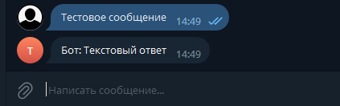

# Обработка сообщений пользователя Reply

[Описание параметров](../parametry.md)

Пример пользователь пишет любое сообщение, и получает от бота обратную связь.

<figure><figcaption></figcaption></figure>

Для обработки пользовательских сообщений используется атрибут **ReplyMenuHandler.**

```csharp
/// <summary>
/// Конструктор.
/// </summary>
/// <param name="botId">Идентификатор бота.</param>
/// <param name="botIds">Идентификаторы ботов.</param>
/// <param name="commandComparison">Как сравнивать команду.</param>
/// <param name="stringComparison">Как сравнивать строку.</param>
/// <param name="commands">Команды.</param>
public ReplyMenuHandlerAttribute(params string[] commands)
public ReplyMenuHandlerAttribute(long botId, params string[] commands)
public ReplyMenuHandlerAttribute(long[] botIds, params string[] commands)
public ReplyMenuHandlerAttribute(CommandComparison commandComparison, params string[] commands)
public ReplyMenuHandlerAttribute(long botId, CommandComparison commandComparison, params string[] commands)
public ReplyMenuHandlerAttribute(long[] botIds, CommandComparison commandComparison, params string[] commands)
public ReplyMenuHandlerAttribute(StringComparison stringComparison, params string[] commands)
public ReplyMenuHandlerAttribute(long botId, StringComparison stringComparison, params string[] commands)
public ReplyMenuHandlerAttribute(long[] botIds, StringComparison stringComparison, params string[] commands)
public ReplyMenuHandlerAttribute(CommandComparison commandComparison, StringComparison stringComparison, params string[] commands)
public ReplyMenuHandlerAttribute(long botId, CommandComparison commandComparison, StringComparison stringComparison, params string[] commands)
public ReplyMenuHandlerAttribute(long[] botIds, CommandComparison commandComparison, StringComparison stringComparison, params string[] commands)
```

Если вы используете ReplyMenuHandlerAttribute без botId это значит, что он автоматически будет искать PRTelegramBot у которого botId = 0.\
Параметр CommandComparison отвечает за то, как сравнивать команды, а именно по точному совпадению или по содержанию.

Параметр **botId** используется если у вас в вашем проекте работает больше 1 бота одновременно. Ниже представлен пример про какой botId идет речь.

```csharp
var telegram = new PRBotBuilder("").SetBotId(0).Build();
```

Пример

```csharp
public class Commands
{
    /// <summary>
    /// Команда отработает для бота с botId 0.
    /// Команда отработает если 'Команда содержит текст' будет содержаться в тексте сообщения.
    /// Так же при проверки будет проигнорирован регистр команды.
    /// </summary>
    [ReplyMenuHandler(CommandComparison.Contains, StringComparison.OrdinalIgnoreCase, "Команда содержит текст")]
    public static async Task ReplyExampleOne(IBotContext context)
    {
        string msg = nameof(ReplyExampleOne);
        await MessageSender.Send(context, msg);
    }
    
    /// <summary>
    /// Команда отработает для бота с botId 0.
    /// Команда отработает если 'Точное совпадение команды' будет точное совпадения текста сообщения за исключением регистра.
    /// </summary>
    [ReplyMenuHandler("Точное совпадение команды")]
    public static async Task ReplyExampleTwo(IBotContext context)
    {
        string msg = nameof(ReplyExampleTwo);
        await MessageSender.Send(context, msg);
    }
 
    /// <summary>
    /// Команда отработает для бота с botId 0.
    /// Напишите в чате "Пример 1" или "Пример 2".
    /// Пример с использованием разных reply команд для работы с 1 функцией.
    /// </summary>
    [ReplyMenuHandler("Пример 1", "Пример 2")]
    public static async Task ExampleReplyMany(IBotContext context)
    {
        string msg = nameof(ExampleReplyMany);
        await MessageSender.Send(context, msg);
    }
 
    /// <summary>
    /// Команда отработает для бота с botId 1.
    /// Команда отработает при написание в чат "Пример команды для бота id 1".
    /// Пример работы с текстом из json файла.
    /// </summary>
    [ReplyMenuHandler(1, "Пример команды для бота id 1")]
    public static async Task ExampleReplyBotIdOne(IBotContext context)
    {
        string msg = nameof(ExampleReplyBotIdOne);
        await MessageSender.Send(context, msg);
    }
    
    /// <summary>
    /// Команда отработает для любого бота с любым botid.
    /// Команда отработает при написание в чат "Команда для всех ботов".
    /// </summary>
    [ReplyMenuHandler(-1, "Команда для всех ботов")]
    public static async Task ReplyExampleAllBots(IBotContext context)
    {
        string msg = nameof(ReplyExampleAllBots);
        await MessageSender.Send(context, msg);
    }
}
```
