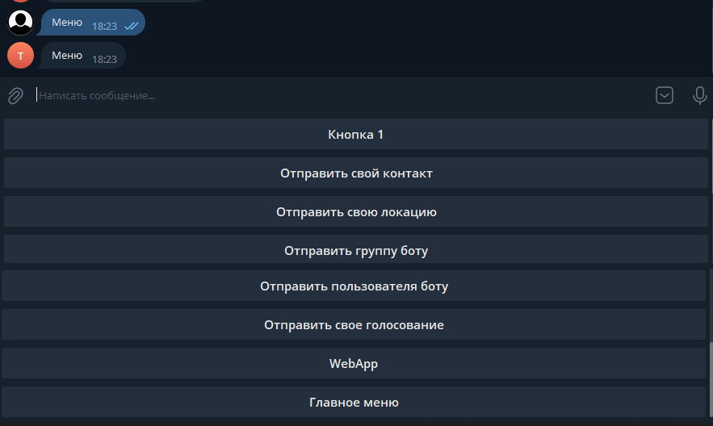
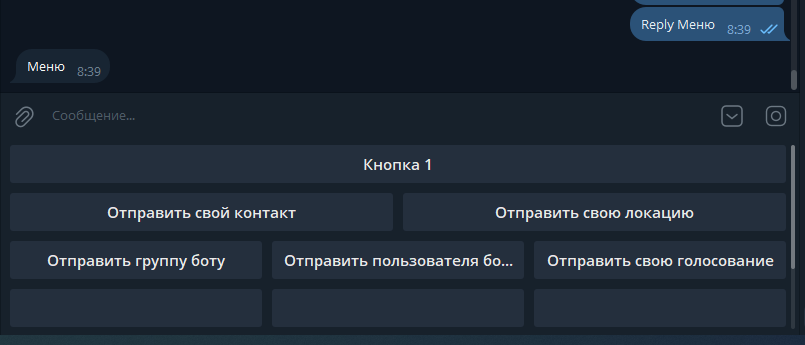

# Создание Reply меню

Перед созданием меню познакомимся со следующими элементами:

* [OptionMessage](../../api/klassy/optionmessage.md)
* MenuGenerator.ReplyKeyboard
* [MessageSender.Send](../../api/klassy/messagesender.md)
* [ReplyKeyboardBuilder](../../api/klassy/replykeyboardbuilder.md)

**OptionMessage** – класс настроек параметров сообщений, позволяет сконфигурировать сообщение перед отправкой в боте.

Свойства:

* ClearMenu – если имеет значение true, очищает меню.
* MenuReplyKeyboardMarkup – если не равен null, к сообщению добавляет простое меню.
* MenuInlineKeyboardMarkup – если не равен null, к сообщению добавляет inline меню.

_**Даже если вы укажите одновременно MenuReplyKeyboardMarkup и MenuInlineKeyboardMarkup будет работать только одно.**_

**MenuGenerator.ReplyKeyboard** – вспомогательный метод, который генерирует меню.

Параметры метода:

* maxColumn – максимальное количество столбцов в меню.
* keyboardButtons или buttons – массив кнопок меню.
* menu – массив простых кнопок меню.
* resizeKeyboard – флаг **resize** из telegram api.
* mainMenu – если не пустой, добавляет в конце меню пункт простой кнопки. (Например может использоваться для показа кнопки “Главное меню”).

**PRTelegramBot.Helpers.Message.Send** – вспомогательный метод обертка над Telegram.Bot. Может принимать помимо самого сообщения еще и параметры с помощью OptionMessage. Так же если размер сообщения будет больше 4000 символов, разделит текст на несколько сообщений.

Пример с комментариями простого меню представлен ниже

```csharp
[ReplyMenuHandler("Меню")]
public static async Task ExampleReplyMenu(IBotContext context)
{
    string msg = "Меню";
    //Создаем настройки сообщения
    var option = new OptionMessage();
    //Создаем список для меню
    var menuList = new List<KeyboardButton>();
 
    //Добавляем кнопку с текстом
    menuList.Add(new KeyboardButton("Кнопка 1"));
    //Добавляем кнопку с запросом на контакт пользователя
    menuList.Add(KeyboardButton.WithRequestContact("Отправить свой контакт"));
    //Добавляем кнопку с запросом на локацию пользователя
    menuList.Add(KeyboardButton.WithRequestLocation("Отправить свою локацию"));
    //Добавляем кнопку с запросом отправки чата боту
    menuList.Add(KeyboardButton.WithRequestChat("Отправить группу боту", new KeyboardButtonRequestChat() { RequestId = 2 }));
    //Добавляем кнопку с запросом отправки пользователя боту
    menuList.Add(KeyboardButton.WithRequestUser("Отправить пользователя боту", new KeyboardButtonRequestUser() { RequestId = 1 }));
    //Добавляем кнопку с отправкой опроса
    menuList.Add(KeyboardButton.WithRequestPoll("Отправить свое голосование"));
    //Добавляем кнопку с запросом работы с WebApp
    menuList.Add(KeyboardButton.WithWebApp("WebApp", new WebAppInfo() { Url = "https://prethink.github.io/telegram/webapp.html" }));
 
    //Генерируем reply меню
    //1 столбец, коллекция пунктов меню, вертикальное растягивание меню, пункт в самом низу по умолчанию
    var menu = MenuGenerator.ReplyKeyboard(1, menuList, true, "Главное меню");
    //Добавляем в настройки меню
    option.MenuReplyKeyboardMarkup = menu;
    await PRTelegramBot.Helpers.Message.Send(context, msg, option);
}
```

Результат работы:

<figure><figcaption></figcaption></figure>

Пример построения с помощью билдера

```csharp
[ReplyMenuHandler("Reply Меню")]
public static async Task ExampleReplyMenu(IBotContext context)
{
string msg = "Меню";
//Создаем настройки сообщения
var option = new OptionMessage();
var keyboard = new ReplyKeyboardBuilder()
            .SetResizeKeyboard(true)
            .AddButton("Кнопка 1")
            .AddRequestContact("Отправить свой контакт", newRow:true)
            .AddRequestLocation("Отправить свою локацию")
            .AddRow()
            .AddRequestChat("Отправить группу боту", new KeyboardButtonRequestChat(2, true))
            .AddRequestUsers("Отправить пользователя боту", new KeyboardButtonRequestUsers() { RequestId = 1 })
            .AddRequestPoll("Отправить свою голосование", new KeyboardButtonPollType())
            .AddEmptyButton(3, newRow:true)
            .AddRow()
            .AddButtonWebApp("WebApp", "https://prethink.github.io/telegram/webapp.html")
            .SetMainMenuButton("Главное меню")
            .Build();

//Добавляем в настройки меню
option.MenuReplyKeyboardMarkup = keyboard;
await MessageSender.Send(context, msg, option);
}
```

<figure><figcaption></figcaption></figure>
