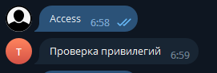
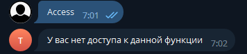

# Ограниченный доступ к командам

### Работа с набором привилегий

PRTelegram бот позволяет обрабатывать команды в зависимости от привилегий пользователей.

Для начала создадим перечисление UserPrivilege, которое будет отмечено атрибутом \[Flags]. Для тех кто не знаком, что за атрибут Flags, посмотрите статью по этой [ссылке](https://learn.microsoft.com/ru-ru/dotnet/api/system.flagsattribute?view=net-5.0).

```csharp
/// <summary>
/// Привилегии пользователей
/// </summary>
[Flags]
public enum UserPrivilege
{
    [Description("Гость")]
    Guest = 1,
    [Description("Зарегистрированный")]
    Registered = 2,
    [Description("Администратор")]
    Admin = 4,
    [Description("VIP")]
    VIP = 8,
    [Description("Модератор")]
    Moderator = 16,
}
```

Создадим метод который хотим ограничить для выполнения определенных пользователей

```csharp
/// <summary>
/// Команда отработает для бота с botId 0.
/// Команда отработает при написание в чат "Проверка доступа".
/// Перед выполнение метода срабатывает событие проверки привилегий <see cref="ExampleEvent.OnCheckPrivilege"/>
/// </summary>
[Access((int)(UserPrivilege.Guest | UserPrivilege.Registered))]
[ReplyMenuHandler("Проверка доступа")]
public static async Task ExampleAccess(IBotContext context)
{
    string msg = nameof(ExampleAccess);
    await MessageSender.Send(context, msg);
}
```

Для проверки привилегий используется атрибут **Access**, который принимает в себя int значение. Это сделано для того чтобы можно было создавать свои перечисления со своим набором привилегий. Принцип работы, закидываем привилегии в виде флагов и преобразуем в int, а потом обратно из int в флаги.

Так же для примера создадим метод расширения заглушку:

```csharp
public static UserPrivilege LoadExampleFlagPrivilege(this Update update)
{
    return UserPrivilege.Registered;
}
```

После создания нового экземпляра класса PRBot мы должны подписаться на события проверки привилегий.

```csharp
telegram.Events.OnCheckPrivilege += OnCheckPrivilege;
 
/// <summary>
/// Событие проверки привилегий пользователя
/// </summary>
/// <param name="callback">callback функция выполняется в случае успеха</param>
/// <param name="mask">Маска доступа</param>
/// Подписка на событие проверки привелегий <see cref="Program"/>
public static async Task OnCheckPrivilege(PrivilegeEventArgs e)
{
    if(!e.Mask.HasValue)
    {
        // Нет маски доступа, выполняем метод.
        await e.ExecuteMethod(e.Context);
        return;
    }

    // Получаем значение маски требуемого доступа.
    var requiredAccess = e.Mask.Value;

    // Получаем флаги доступа пользователя.
    // Здесь вы на свое усмотрение реализываете логику получение флагов, например можно из базы данных получить.
    var userFlags = e.Context.Update.LoadExampleFlagPrivilege();

    if(requiredAccess.HasFlag(userFlags))
    {
        // Доступ есть, выполняем метод.
        await e.ExecuteMethod(e.Context);
        return;
    }

    // Доступа нет.
    string errorMsg = "У вас нет доступа к данной функции";
    await MessageSender.Send(e.Context, errorMsg);
    return;

}
```

Результаты работы:

<figure><figcaption></figcaption></figure>

<figure><figcaption></figcaption></figure>
