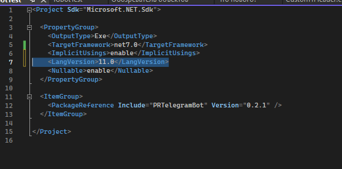

# Обработка Inline команд

Сигнатура методов для обработки InlineCallBack команда следующая

```csharp
[InlineCallbackHandler<Перечисление>(Перечисление.Значение)]
public static async Task НазваниеМетода(IBotContext context)
{
    //Обработка
}
 
[InlineCallbackHandler<Перечисление>(Перечисление.Значение, Перечисление.Значение)]
public static async Task НазваниеМетода(IBotContext context)
{
    //Обработка
}
```

При использование атрибута InlineCallbackHandler может возникнуть ошибка которая на рисунке ниже.

<figure><figcaption></figcaption></figure>

Для решения данной проблемы нужно поменять версию языка, это можно сделать кликнув 2 раза левой кнопкой мыши на проект.

<figure><figcaption></figcaption></figure>

И добавить строчку 11.0

<figure><figcaption></figcaption></figure>

Пример кода для обработки InlineCallback команд:

```csharp
/// <summary>
/// callback обработка
/// Обрабатывает одну точку входа
/// </summary>
[InlineCallbackHandler<CustomTHeader>(CustomTHeader.ExampleOne)]
public static async Task Inline(IBotContext context)
{
    //Попытка преобразовать callback данные к требуемому типу
    var command = InlineCallback.GetCommandByCallbackOrNull(context);
    if (command != null)
    {
        string msg = "Выполнена команда callback";
        await MessageSender.Send(context, msg);
    }
}
 
/// <summary>
/// callback обработка
/// Данный метод может обработать несколько точек входа
/// </summary>
[InlineCallbackHandler<CustomTHeader>(CustomTHeader.ExampleTwo, CustomTHeader.ExampleThree)]
public static async Task InlineTwo(IBotContext context)
{
 
    //Попытка преобразовать callback данные к требуемому типу
    var command = InlineCallback<EntityTCommand<long>>.GetCommandByCallbackOrNull(context);
    if (command != null)
    {
        string msg = $"Идентификатор который вы передали {command.Data.EntityId}";
        await MessageSender.Send(context, msg);
    }
 
}
```

Результат работы:

<figure><figcaption></figcaption></figure>
