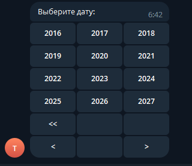

# Работа с календарем

PRTelegramBot предоставляет возможность работы с календарем из коробки. За основу был взят пакет CalendarPicker | karb0f0s [https://github.com/karb0f0s/CalendarPicker](https://github.com/karb0f0s/CalendarPicker).

Вид календаря представлен на рисунках ниже:

<figure><figcaption></figcaption></figure>

<figure><figcaption></figcaption></figure>

<figure><figcaption></figcaption></figure>

<figure><figcaption></figcaption></figure>

Для работы с календарем используется [CalendarUtils](../api/utils/calendarutils.md).&#x20;

Пример:

<pre class="language-csharp"><code class="lang-csharp"><strong>/// &#x3C;summary>
</strong>/// Напишите в чат Calendar
/// Вызов команды календаря
/// &#x3C;/summary>
[ReplyMenuHandler("Calendar")]
public static async Task PickCalendar(IBotContext context)
{
    try
    {
        await CalendarUtils.Create(context, CustomTHeader.CalendarCallback, "Выберите дату:");
    }
    catch (Exception ex)
    {
        Console.WriteLine(ex);
    }
}

/// &#x3C;summary>
/// Напишите в чат EngCalendar
/// Вызов команды календаря на английском языке
/// &#x3C;/summary>
[ReplyMenuHandler("EngCalendar")]
public static async Task EngPickCalendar(IBotContext context)
{
    try
    {
        await CalendarUtils.Create(context, CultureInfo.GetCultureInfo("en-US", false), CustomTHeader.CalendarCallback, "Choose date:");
    }
    catch (Exception ex)
    {
        Console.WriteLine(ex);
    }
}

/// &#x3C;summary>
/// Обработка выбраной даты
/// &#x3C;/summary>
[InlineCallbackHandler&#x3C;CustomTHeader>(CustomTHeader.CalendarCallback)]
public static async Task PickDate(IBotContext context)
{
    var bot = context.Current;
    try
    {
        using (var inlineHandler = new InlineCallback&#x3C;CalendarTCommand>(context))
        {
            var command = inlineHandler.GetCommandByCallbackOrNull();
            await MessageSender.Send(context, command.Data.Date.ToString());
        }
    }
    catch (Exception ex)
    {
        bot.Events.OnErrorLogInvoke(new ErrorLogEventArgs(context, ex));
    }
}
</code></pre>

